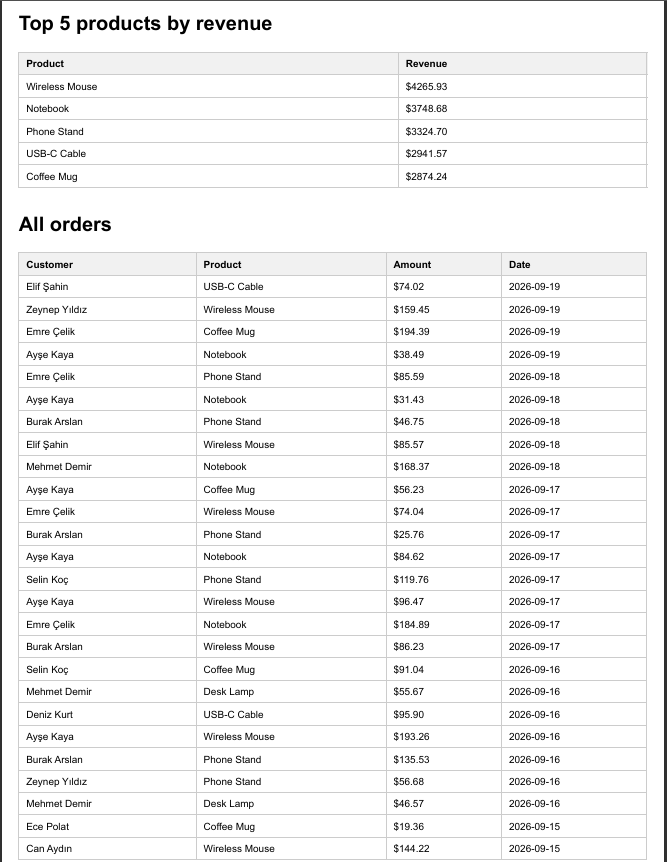

# PDF Report Generator

A small pipeline that queries a SQLite database, aggregates the data with SQL,
renders it into a PDF report via Playwright, and serves the file through a
FastAPI endpoint.

## Dataset

The "little shop" option: a SQLite `orders` table with ~200 seeded rows
(customer, product, amount, created_at).

## How to run

1. Create and activate a virtual environment, then install dependencies:

   python -m venv .venv
   .venv\Scripts\activate
   pip install fastapi uvicorn playwright
   playwright install chromium

2. Seed the database:

   python seed.py

3. Start the API:

   uvicorn main:app --reload

4. Generate and download a report:

   curl -i -X POST http://localhost:8000/reports
   curl -o my-report.pdf http://localhost:8000/reports/1/file

## Aggregation SQL

Total orders:

   SELECT COUNT(*) FROM orders;

Total revenue:

   SELECT SUM(amount) FROM orders;

Top 5 products by revenue:

   SELECT product, SUM(amount) AS revenue
   FROM orders
   GROUP BY product
   ORDER BY revenue DESC
   LIMIT 5;

Orders per day, last 7 days:

   SELECT created_at, COUNT(*) AS count
   FROM orders
   WHERE created_at >= date('now', '-7 days')
   GROUP BY created_at
   ORDER BY created_at;

## Download proof

`POST /reports` returns 201 with an id and file link after a short pause
(the pipeline runs synchronously inside the request); the PDF is then
downloaded via `GET /reports/:id/file`.

## Stage 4 note

At what point would this move out of the request? Once the table gets large
(thousands of rows) or multiple users hit the endpoint concurrently, the
multi-second render would start blocking other requests — that's where a
background job (A7-style) would take over.

## Stage 5 note

The duplicate check protects against a user double-clicking "Generate report"
and getting two identical PDFs for no reason. A real-world example: an
e-commerce checkout button without idempotency can charge a customer's card
twice for the same order.

## Screenshot

